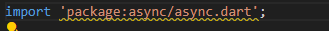
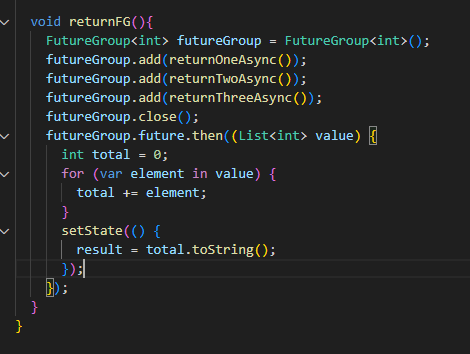
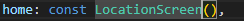

# PRAKTIKUM 1 : MENGUNGDUH DATA DARI WEB SERVICE (API)

## Langkah 1: Buat Project Baru

Buatlah sebuah project flutter baru dengan nama books di folder src week-11 repository GitHub Anda.

Kemudian Tambahkan dependensi http dengan mengetik perintah berikut di terminal.


## Langkah 2: Cek file pubspec.yaml

Jika berhasil install plugin, pastikan plugin http telah ada di file pubspec ini seperti berikut.


## Langkah 3: Buka file main.dart

Ketiklah kode seperti berikut ini.

    Soal 1
    Tambahkan nama panggilan Anda pada title app sebagai identitas hasil pekerjaan Anda.


## Langkah 4: Tambah method getData()

Tambahkan method ini ke dalam class \_FuturePageState yang berguna untuk mengambil data dari API Google Books.


    Soal 2
    Carilah judul buku favorit Anda di Google Books, lalu ganti ID buku pada variabel path di kode tersebut. Caranya ambil di URL browser Anda seperti gambar berikut ini.


## Langkah 5: Tambah kode di ElevatedButton
Tambahkan kode pada onPressed di ElevatedButton seperti berikut.


    Soal 3
    Jelaskan maksud kode langkah 5 tersebut terkait substring dan catchError!
    jawab :
    substring(0,450) = mengambil karakter dari indeks 0 - 450, jika kurang maka akan menyebabkan error.
    catcherror, jika terjadi kesalan saat memanggil getData(), fungsi ini dipanggil dan menangani error berupa menampilkan pesan error dan memanggil setState untuk update tampilan.


# PRAKTIKUM 2 : MENGGUNAKAN AWAIT/ASYNC UNTUK MENGHINDARI CALLBACKS
## Langkah 1 : Buka file main.dart
Tambahkan tiga method berisi kode seperti berikut di dalam class _FuturePageState.


## Langkah 2: Tambah method count()
Lalu tambahkan lagi method ini di bawah ketiga method sebelumnya.


## Langkah 3: Panggil count()
Lakukan comment kode sebelumnya, ubah isi kode onPressed() menjadi seperti berikut.


## Langkah 4: Run
Akhirnya, run atau tekan F5 jika aplikasi belum running. Maka Anda akan melihat seperti gambar berikut, hasil angka 6 akan tampil setelah delay 9 detik.


# PRAKTIKUM 3 : MENGGUNAKAN COMPLETER DI FUTURE
## Langkah 1: Buka main.dart
Pastikan telah impor package async berikut.




## Langkah 2: Tambahkan variabel dan method
Tambahkan variabel late dan method di class _FuturePageState seperti ini.


## Langkah 3: Ganti isi kode onPressed()
Tambahkan kode berikut pada fungsi onPressed(). Kode sebelumnya bisa Anda comment.


## Langkah 4:
Terakhir, run atau tekan F5 untuk melihat hasilnya jika memang belum running. Bisa juga lakukan hot restart jika aplikasi sudah running. Maka hasilnya akan seperti gambar berikut ini. Setelah 5 detik, maka angka 42 akan tampil.

    Soal 5
    Jelaskan maksud kode langkah 2 tersebut!
    Jawab : 

    ```
    late Completer completer;
    ```
    untuk deklarasi Completer (objek yang digunakan untuk membuat Future() diselesaikan)

    ```
    Future getNumber() {
        completer = Completer<int>();
        calculate();
        return completer.future;
    }
    ```
    untuk membuat instance baru dari Completer<int>, lalu memanggil fungsi calculate() untuk memulai proses asyncrhonous, lalu mengembalikan complater.future, yang merupakan objek Future yang akan menyelesaikan nilainya ketika completer.complete() dipanggil.

    ```
    Future calculate() async {
        await Future.delayed(const Duration(seconds: 5));
        completer.complete(42);
    }
    ```
    fungsi async dan menggunakan Future.delayed untuk menunggu selama nilai yang diberikan (dalam kode ini 5 detik), setelah 5 detik, maka akan memanggil completer.complete(42), menandakan bahwa Future telah selesai dengan nilai 42.

    Capture hasil praktikum Anda berupa GIF dan lampirkan di README. Lalu lakukan commit dengan pesan "W11: Soal 5".


## Langkah 5: Ganti method calculate()
Gantilah isi code method calculate() seperti kode berikut, atau Anda dapat membuat calculate2()


## Langkah 6: Pindah ke onPressed()
Ganti menjadi kode seperti berikut.

    Soal 6
    Jelaskan maksud perbedaan kode langkah 2 dengan langkah 5-6 tersebut!
    Jawab : 
    ada 3 point penting pembeda antara langkah 2 dan langkah 5-6, error handling yang diberikan pada try-catch, Completer completion yang ada pada langkah 2, dan responsiveness yang diberikan untuk pengguna. 

    Capture hasil praktikum Anda berupa GIF dan lampirkan di README. Lalu lakukan commit dengan pesan "W11: Soal 6".


# PRAKTIKUM 4 : MEMANGGIL FUTURE SECARA PARALEL

## Langkah 1: Buka file main.dart
Tambahkan method ini ke dalam class _FuturePageState



## Langkah 2: Edit onPressed()
Anda bisa hapus atau comment kode sebelumnya, kemudian panggil method dari langkah 1 tersebut.


## Langkah 3: Run
Anda akan melihat hasilnya dalam 3 detik berupa angka 6 lebih cepat dibandingkan praktikum sebelumnya menunggu sampai 9 detik.


    Soal 7
    Capture hasil praktikum Anda berupa GIF dan lampirkan di README. Lalu lakukan commit dengan pesan "W11: Soal 7".

## Langkah 4: Ganti variabel futureGroup
Anda dapat menggunakan FutureGroup dengan Future.wait seperti kode berikut.


    soal 8 
    jelaskan maksud perbedaan kode langkah 1 dan 4!
    jawab : 
    Perbedaan :
    pendekatan, Future.wait langsung mengumpulkan dalam satu panggilan, sementara FutureGroup memungkinkan penambahan future secara dinamis
    FLeksibelitas, Future.wait lebih sederhana untuk static case, FutureGroup lebih fleksibel untuk skenario dimana Future mungkin ditambahkan atau diubah di runtime
    siklus, Future.wait menyelesaikan ketika semua selesai, FutureGroup memerlukan pemanggilan close() untuk menyelesaikan grup

# PRAKTIKUM 5 : MENANGANI RESPON ERROR PADA ASYNC CODE

## Langkah 1: Buka file main.dart
Tambahkan method ini ke dalam class _FuturePageState


## Langkah 2: ElevatedButton
Ganti dengan kode berikut


## Langkah 3: Run
Lakukan run dan klik tombol GO! maka akan menghasilkan seperti gambar berikut.


Pada bagian debug console akan melihat teks Complete seperti berikut.


    Soal 9
    Capture hasil praktikum berupa GIF dan lampirkan pada README. Lakukan commit dengan pesan "W11:Soal9"


## Langkah 4: Tambah method handleError()
Tambahkan kode ini di dalam class _FutureStatePage


    Soal 10
    Panggil method handleError() tersebut di ElevatedButton, lalu run. Apa hasilnya? Jelaskan perbedaan kode langkah 1 dan 4!
    Jawab : 
    perbedaan struktur kode, yaitu pada kode pertama menggunakan try-catch, yang lebih mudah dibaca. Kode kedua menggunakan chaining then dan catchError yang membuatnya lebih rumit untuk dibaca jika ada banyak operasi.

# PRAKTIKUM 6 : MENGGUNAKAN FUTURE DENGAN STATEFULL WIDGET
## Langkah 1: install plugin geolocator
Tambahkan plugin geolocator dengan mengetik perintah berikut di terminal.


## Langkah 2: Tambah permission GPS
Jika Anda menargetkan untuk platform Android, maka tambahkan baris kode berikut di file android/app/src/main/androidmanifest.xml


Jika Anda menargetkan untuk platform iOS, maka tambahkan kode ini ke file Info.plist

## Langkah 3: Buat file geolocation.dart
Tambahkan file baru ini di folder lib project Anda.


## Langkah 4: Buat StatefulWidget
Buat class LocationScreen di dalam file geolocation.dart


## Langkah 5: Isi kode geolocation.dart

    Soal 11
    Tambahkan nama panggilan Anda pada tiap properti title sebagai identitas pekerjaan Anda.


## Langkah 6: Edit main.dart
Panggil screen baru tersebut di file main Anda seperti berikut.



## Langkah 7: Run
Run project Anda di device atau emulator (bukan browser), maka akan tampil seperti berikut ini.


## Langkah 8: Tambahkan animasi loading
Tambahkan widget loading seperti kode berikut. Lalu hot restart, perhatikan perubahannya.


    Soal 12
    Jika Anda tidak melihat animasi loading tampil, kemungkinan itu berjalan sangat cepat. Tambahkan delay pada method getPosition() dengan kode await Future.delayed(const Duration(seconds: 3));

    Apakah Anda mendapatkan koordinat GPS ketika run di browser? Mengapa demikian?

    Capture hasil praktikum Anda berupa GIF dan lampirkan di README. Lalu lakukan commit dengan pesan "W11: Soal 12".


# PRAKTIKUM 7 : 