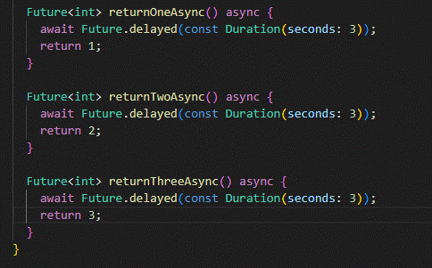

# PRAKTIKUM 1

## Langkah 1: Buat Project Baru

Buatlah sebuah project flutter baru dengan nama books di folder src week-11 repository GitHub Anda.

Kemudian Tambahkan dependensi http dengan mengetik perintah berikut di terminal.

## Langkah 2: Cek file pubspec.yaml

Jika berhasil install plugin, pastikan plugin http telah ada di file pubspec ini seperti berikut.

## Langkah 3: Buka file main.dart

Ketiklah kode seperti berikut ini.

    Soal 1
    Tambahkan nama panggilan Anda pada title app sebagai identitas hasil pekerjaan Anda.

## Langkah 4: Tambah method getData()

Tambahkan method ini ke dalam class \_FuturePageState yang berguna untuk mengambil data dari API Google Books.

    Soal 2
    Carilah judul buku favorit Anda di Google Books, lalu ganti ID buku pada variabel path di kode tersebut. Caranya ambil di URL browser Anda seperti gambar berikut ini.

## Langkah 5: Tambah kode di ElevatedButton
Tambahkan kode pada onPressed di ElevatedButton seperti berikut.

    Soal 3
    Jelaskan maksud kode langkah 5 tersebut terkait substring dan catchError!
    jawab :
    substring(0,450) = mengambil karakter dari indeks 0 - 450, jika kurang maka akan menyebabkan error.
    catcherror, jika terjadi kesalan saat memanggil getData(), fungsi ini dipanggil dan menangani error berupa menampilkan pesan error dan memanggil setState untuk update tampilan.

# PRAKTIKUM 2
## Langkah 1 : Buka file main.dart
Tambahkan tiga method berisi kode seperti berikut di dalam class _FuturePageState.

## Langkah 2: Tambah method count()
Lalu tambahkan lagi method ini di bawah ketiga method sebelumnya.

## Langkah 3: Panggil count()
Lakukan comment kode sebelumnya, ubah isi kode onPressed() menjadi seperti berikut.

## Langkah 4: Run
Akhirnya, run atau tekan F5 jika aplikasi belum running. Maka Anda akan melihat seperti gambar berikut, hasil angka 6 akan tampil setelah delay 9 detik.

