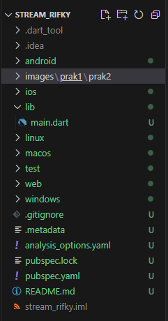
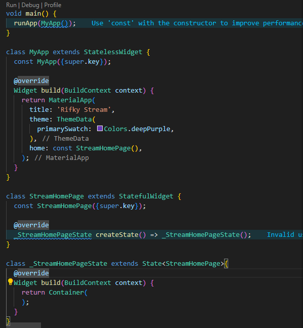

# Praktikum 1 : Dart Streams
## Langkah 1 : Buat project baru
Buatlah sebuah project flutter baru dengan nama stream_nama (beri nama panggilan Anda) di folder week-12/src/ repository GitHub Anda.

## Langkah 2 : Buka file main.dart
ketikkan kode seperti berikut ini.

## Langkah 1 : Buat project baru
Buatlah sebuah project flutter baru dengan nama stream_nama (beri nama panggilan Anda) di folder week-12/src/ repository GitHub Anda.

## Langkah 1 : Buat project baru
Buatlah sebuah project flutter baru dengan nama stream_nama (beri nama panggilan Anda) di folder week-12/src/ repository GitHub Anda.