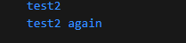
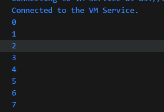
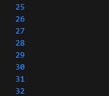
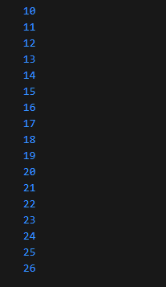
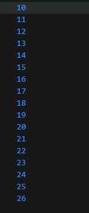
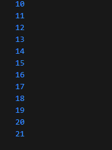

# Pengantar Bahasa Pemrograman Dart bagian 2

## Praktikum 1

- Menerpkan Control flows ("if/else")

1. ketik atau salin kode berikut pada fungsi main().

```
String test = "test2";
if (test == "test1") {
   print("Test1");
} else If (test == "test2") {
   print("Test2");
} Else {
   print("Something else");
}

if (test == "test2") print("Test2 again");
```

2.  Silakan coba eksekusi (Run) kode pada langkah 1 tersebut. Apa yang terjadi? Jelaskan!

        Jawab : error yang dikarenakan penulisan If dan Else yang seharusnya diawali huruf kecil. Setelah pembenahan output:

    

3.  Tambahkan kode program berikut, lalu coba eksekusi (Run) kode Anda.

```
String test = "true";
if (test) {
   print("Kebenaran");
}
```

Apa yang terjadi ? Jika terjadi error, silakan perbaiki namun tetap menggunakan if/else.

Jawab : setelah saya run, terjadi error. Berikut kode yg sudah saya benahi

```
  String test = "true";
  if (test == "true") {
    print("kebenaran");
  }
```

output:


## Praktikum 2

- Menerapkan Perulangan "while" dan "do-while"

1. Ketik atau salin kode program berikut ke dalam fungsi main().

```
while (counter < 33) {
  print(counter);
  counter++;
}
```

2. Silakan coba eksekusi (Run) kode pada langkah 1 tersebut. Apa yang terjadi? Jelaskan! Lalu perbaiki jika terjadi error.

Jawab : terjadi error yang dikarenakan variabel counter tidak terdefinisi, sehingga perlu dilakukan pendefinisian terlebih dahulu, disini saya definisikan counter = 0. Sehingga output akan mencetak angka dari 0 - 32, seperti hasil berikut :




3. Tambahkan kode program berikut, lalu coba eksekusi (Run) kode Anda.

```
do {
  print(counter);
  counter++;
} while (counter < 77);

```

Apa yang terjadi ? Jika terjadi error, silakan perbaiki namun tetap menggunakan do-while.

Jawab : ketika saya eksekusi (run) akan mencetak dari 0 - 76, karena saya mendefinisikan counter = 0, hasil :



## Praktikum 3

- Menerapkan Perulangan "for" dan "break-continue"

1. Ketik atau salin kode program berikut ke dalam fungsi main().

```
for (Index = 10; index < 27; index) {
  print(Index);
}
```

2. Silakan coba eksekusi (Run) kode pada langkah 1 tersebut. Apa yang terjadi? Jelaskan! Lalu perbaiki jika terjadi error.
   Jawab : error terjadi dikarenakan index tidak di increment, sehingga terjadi infinity loop yang tidak berakhir, maka harus diubah menjadi counter++ untuk membatasi index agar memenuhi syarat "index<27". Hasil:

   

3. Tambahkan kode program berikut di dalam for-loop, lalu coba eksekusi (Run) kode Anda.

```
If (Index == 21) break;
Else If (index > 1 || index < 7) continue;
print(index);
```

Jawab : ketika di eksekusi(run), maka akan mencetak angka dari 10 - 21, karena pada syarat didalamnya, ketika index bernilai 21, maka akan berhenti, lalu else if tidak akan dieksekusi karena syarat yang tidak terpenuhi. Hasil :


