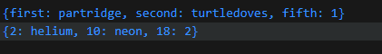

# Pengantar Bahasa Pemrograman Dart - Bagian 3

## Praktikum 1

- Eksperimen Tipe Data List

1. Ketik atau salin kode program berikut ke dalam void main().

```
var list = [1, 2, 3];
assert(list.length == 3);
assert(list[1] == 2);
print(list.length);
print(list[1]);

list[1] = 1;
assert(list[1] == 1);
print(list[1]);
```

2. Silahkan coba eksekusi (run) kode pada langkah 1 tersebut. Apa yang terjadi? Jelaskan!

Jawab : mengeluarkan output berupa mencetak angka dari 3 2 1.

3. Ubah kode pada langkah 1 menjadi variabel final yang mempunyai index = 5 dengan default value = null. Isilah nama dan NIM Anda pada elemen index ke-1 dan ke-2. Lalu print dan capture hasilnya.

Jawab :
Kode program :

Hasil :


## Praktikum 2

- Eksperimen tipe data set

1. Ketik atau salin kode program berikut ke dalam fungsi main().

```
var halogens = {'fluorine', 'chlorine', 'bromine', 'iodine', 'astatine'};
print(halogens);
```

2. Silakan coba eksekusi (Run) kode pada langkah 1 tersebut. Apa yang terjadi? Jelaskan! Lalu perbaiki jika terjadi error.
   Jawab : Mendapatkan output sebagai berikut :


3. Tambahkan kode program berikut, lalu coba eksekusi (Run) kode Anda.

```
var names1 = <String>{};
Set<String> names2 = {}; // This works, too.
var names3 = {}; // Creates a map, not a set.

print(names1);
print(names2);
print(names3);
```

Apa yang terjadi ? Jika terjadi error, silakan perbaiki namun tetap menggunakan ketiga variabel tersebut. Tambahkan elemen nama dan NIM Anda pada kedua variabel Set tersebut dengan dua fungsi berbeda yaitu .add() dan .addAll(). Untuk variabel Map dihapus, nanti kita coba di praktikum selanjutnya.

Jawab :
ketika di eksekusi, mengeluarkan hasil kosong berupa :


namun, ketika maps dihapus, maka mendapatkan hasil error, dimana variable names3 tidak dapat dicetak.

Lalu, berikut merupakan modifikasi setelah ditambahkan elemen:

```
void praktikum2Langkah2() {
  var names1 = <String>{}; // Set kosong
  Set<String> names2 = {}; // Set kosong, ini juga valid

  // Menambahkan elemen ke names1 menggunakan .add()
  names1.add("Rifky");
  names1.add("2241720176");

  // Menambahkan elemen ke names2 menggunakan .addAll()
  names2.addAll([
    "Rifky",
    "2241720176"
  ]);
  // Mencetak hasil
  print(names1); // Menampilkan isi dari names1
  print(names2); // Menampilkan isi dari names2
}
```

Hasil :


## Praktikum 3

- Eksperimen Tipe Data Maps

1. Ketik atau salin kode program berikut ke dalam fungsi main().

```
var gifts = {
  // Key:    Value
  'first': 'partridge',
  'second': 'turtledoves',
  'fifth': 1
};

var nobleGases = {
  2: 'helium',
  10: 'neon',
  18: 2,
};

print(gifts);
print(nobleGases);
```

2. Silakan coba eksekusi (Run) kode pada langkah 1 tersebut. Apa yang terjadi? Jelaskan! Lalu perbaiki jika terjadi error.

Jawab :



tidak ada error, program mencetak hasil sesuai dengan yang telah diset pada sintaks.

3. Tambahkan kode program berikut, lalu coba eksekusi (Run) kode Anda.

```
var mhs1 = Map<String, String>();
gifts['first'] = 'partridge';
gifts['second'] = 'turtledoves';
gifts['fifth'] = 'golden rings';

var mhs2 = Map<int, String>();
nobleGases[2] = 'helium';
nobleGases[10] = 'neon';
nobleGases[18] = 'argon';
```

Apa yang terjadi ? Jika terjadi error, silakan perbaiki.

Tambahkan elemen nama dan NIM Anda pada tiap variabel di atas (gifts, nobleGases, mhs1, dan mhs2).

Jawab :

Terjadi error, berupa gifts dan nobleGases yang belum terdeklarasikan, pembenahan sintaks sesuai yang diinginkan :

```
// Deklarasi dan inisialisasi Map
  var gifts = Map<String, String>();
  gifts['first'] = 'partridge';
  gifts['second'] = 'turtledoves';
  gifts['fifth'] = 'golden rings';

  var mhs1 = Map<String, String>();
  mhs1['name'] = 'Rifky';
  mhs1['NIM'] = '2241720176';

  var nobleGases = Map<int, String>();
  nobleGases[2] = 'helium';
  nobleGases[10] = 'neon';
  nobleGases[18] = 'argon';

  var mhs2 = Map<int, String>();
  mhs2[1] = 'Rifky';
  mhs2[2] = '22241720176';

  // Mencetak hasil
  print("Gifts: $gifts");
  print("MHS1: $mhs1");
  print("Noble Gases: $nobleGases");
  print("MHS2: $mhs2");
```

output :


# Praktikum 4

- Eksperimen Tipe Data List: Spread dan Control-flow Operators

1. Ketik atau salin kode program berikut ke dalam fungsi main().

```
var list = [1, 2, 3];
var list2 = [0, ...list];
print(list1);
print(list2);
print(list2.length);
```

2. Silakan coba eksekusi (Run) kode pada langkah 1 tersebut. Apa yang terjadi? Jelaskan! Lalu perbaiki jika terjadi error.

Jawab: Akan terjadi error, pada bagian "print(list1);" dimana list1 tidak didefinisikan sebelumnya, sebaliknya var list yang sudah didefinisikan justru tidak di print, oleh karena itu akan saya rubah dengan print(list);. Hasil :


pada output baris pertama, didapat dari print(list), baris kedua didapat dari list2+list, baris ketiga berisi panjang dari list2.

3. Tambahkan kode program berikut, lalu coba eksekusi (Run) kode Anda.

```
list1 = [1, 2, null];
print(list1);
var list3 = [0, ...?list1];
print(list3.length);
```

Apa yang terjadi ? Jika terjadi error, silakan perbaiki.
Tambahkan variabel list berisi NIM Anda menggunakan Spread Operators. Dokumentasikan hasilnya dan buat laporannya!

Jawab: terjadi error yang dikarenakan pendefinisian list1 yang salah, seharusnya ditambahi "var" di depan list.Untuk code yang diminta, sebagai berikut:

```
void praktikum4Langkah3() {
  var list1 = [1, 2, null];
  print(list1);
  var list3 = [0, ...list1];
  print(list3.length);
  var nim = [2241720176];
  var list4 = [...list3, ...nim];
  print(list4);
}

```


4. Tambahkan kode program berikut, lalu coba eksekusi (Run) kode Anda.

```
var nav = ['Home', 'Furniture', 'Plants', if (promoActive) 'Outlet'];
print(nav);
```

Apa yang terjadi ? Jika terjadi error, silakan perbaiki. Tunjukkan hasilnya jika variabel promoActive ketika true dan false.

Jawab: Terjadi error karena variable promoActive belum didefinisikan dan diminta untuk melakukan kondisional if, maka perlu mendefinisikan promoActive dengan nilai boolean(true/false), berikut hasil jika promoActive = true, dan false:


5. Tambahkan kode program berikut, lalu coba eksekusi (Run) kode Anda.

```
var nav2 = ['Home', 'Furniture', 'Plants', if (login case 'Manager') 'Inventory'];
print(nav2);
```

Apa yang terjadi ? Jika terjadi error, silakan perbaiki. Tunjukkan hasilnya jika variabel login mempunyai kondisi lain.

Jawab : terjadi error dan saya benahi sebagai berikut

```
  var login = 'Manager'; // Ubah nilai untuk contoh lain
  var nav2 = [
    'Home',
    'Furniture',
    'Plants',
    if (login == 'Manager') 'Inventory'
  ];
  print(nav2);
```

dengan output:


apabila login saya ganti selain sebagai manager (saya coba ubah ke user), maka output yang dihasilkan :


6. Tambahkan kode program berikut, lalu coba eksekusi (Run) kode Anda.

```
var listOfInts = [1, 2, 3];
var listOfStrings = ['#0', for (var i in listOfInts) '#$i'];
assert(listOfStrings[1] == '#1');
print(listOfStrings);
```

Apa yang terjadi ? Jika terjadi error, silakan perbaiki. Jelaskan manfaat Collection For dan dokumentasikan hasilnya.

Jawab : Output :


Manfaat penggunaan Collection for:
a. Efisiensi yang didapat karena bisa membuat list baru dari list yang sudah ada dengan lebih ringkas dan efisien.
b. Kode yang lebih mudah dibaca dan dipahami karena dapat mengekspresikan transformasi data dalam satu baris.
c. Dapat dengan mudah menambah kode/menerapkan logika tambahan saat membangun list baru.

# Praktikum 5

- Eksperimen Tipe Data Records

1. Ketik atau salin kode program berikut ke dalam fungsi main().

```
var record = ('first', a: 2, b: true, 'last');
print(record)
```

2. Silakan coba eksekusi (Run) kode pada langkah 1 tersebut. Apa yang terjadi? Jelaskan! Lalu perbaiki jika terjadi error.

Jawab: output yang dihasilkan berupa cetakan isi record yang sudah di inisialisasikan.


3. Tambahkan kode program berikut di luar scope void main(), lalu coba eksekusi (Run) kode Anda.

```
(int, int) tukar((int, int) record) {
  var (a, b) = record;
  return (b, a);
}
```

Apa yang terjadi ? Jika terjadi error, silakan perbaiki. Gunakan fungsi tukar() di dalam main() sehingga tampak jelas proses pertukaran value field di dalam Records.

Jawab : Terjadi error yang dikarenakan var record yang belum didefinisikan di voidmain, maka ketika sudah didefinisikan, output:


4. Tambahkan kode program berikut di dalam scope void main(), lalu coba eksekusi (Run) kode Anda.

```
// Record type annotation in a variable declaration:
(String, int) mahasiswa;
print(mahasiswa);
```

Apa yang terjadi ? Jika terjadi error, silakan perbaiki. Inisialisasi field nama dan NIM Anda pada variabel record mahasiswa di atas. Dokumentasikan hasilnya dan buat laporannya!

Jawab : error karena nilai mahasiswa belum diinisialisasikan, sesuai dengan request, maka output yang dihasilkan :


5. Tambahkan kode program berikut di dalam scope void main(), lalu coba eksekusi (Run) kode Anda.

```
var mahasiswa2 = ('first', a: 2, b: true, 'last');

print(mahasiswa2.$1); // Prints 'first'
print(mahasiswa2.a); // Prints 2
print(mahasiswa2.b); // Prints true
print(mahasiswa2.$2); // Prints 'last'
```

Apa yang terjadi ? Jika terjadi error, silakan perbaiki. Gantilah salah satu isi record dengan nama dan NIM Anda, lalu dokumentasikan hasilnya dan buat laporannya!

Jawab : tidak ada error yang terjadi,sesuai dengan request maka saya isi record dengan nama dan nim saya, output :


### Tugas Praktikum

1. Jelaskan yang dimaksud Functions dalam bahasa Dart!
2. Jelaskan jenis-jenis parameter di Functions beserta contoh sintaksnya!
3. Jelaskan maksud Functions sebagai first-class objects beserta contoh sintaknya!
4. Apa itu Anonymous Functions? Jelaskan dan berikan contohnya!
5. Jelaskan perbedaan Lexical scope dan Lexical closures! Berikan contohnya!
6. Jelaskan dengan contoh cara membuat return multiple value di Functions!

Jawab :

1. Functions adalah blok kode yang dirancang untuk melakukan tugas tertentu. Fungsi dapat menerima input (parameter) dan dapat mengembalikan output (nilai). Dalam Dart, fungsi dapat dideklarasikan dengan kata kunci void (jika tidak mengembalikan nilai) atau dengan tipe data tertentu (jika mengembalikan nilai). Fungsi membantu dalam pengorganisasian kode, meningkatkan keterbacaan, dan memudahkan pemeliharaan.

2. Parameter Posisi: Parameter biasa yang diharuskan diisi sesuai urutan.

```
Copy
void greet(String name) {
  print('Hello, $name!');
}
```

Parameter Opsional: Parameter yang tidak wajib diisi. Ada dua jenis:

2.1 Parameter Opsional Posisi: Dideklarasikan dalam tanda kurung siku.

```
void greet(String name, [String? title]) {
  if (title != null) {
    print('Hello, $title $name!');
  } else {
    print('Hello, $name!');
  }
}
```

2.2 Parameter Opsional Bernama: Dideklarasikan dalam tanda kurung kurawal.

```
void greet(String name, {String? title}) {
  if (title != null) {
    print('Hello, $title $name!');
  } else {
    print('Hello, $name!');
  }
}
```

3. function sebagai first-class object, fungsi dianggap sebagai objek kelas pertama.fungsi dapat disimpan dalam variabel, diteruskan sebagai parameter, dan dikembalikan dari fungsi lain.

```
void main() {
  // Menyimpan fungsi dalam variabel
  var greet = (String name) => print('Hello, $name!');

  // Memanggil fungsi
  greet('Alice');
}
```

4. Anonymous function adalah fungsi yang tidak memiliki nama dan biasanya digunakan sebagai fungsi sementara, atau ketika fungsi tersebut akan digunakan sekali saja. Contoh:

```
void main() {
  var numbers = [1, 2, 3, 4];

  // Menggunakan anonymous function untuk mencetak angka
  numbers.forEach((number) {
    print(number);
  });
}
```

5. Perbedaan Lexical Scope dan Lexical Closures

   a. Lexical Scope Menentukan aksesibilitas variabel berdasarkan struktur kode. Variabel yang dideklarasikan dalam fungsi hanya dapat diakses dalam fungsi tersebut dan tidak di luar fungsi.

   ```
   void main() {
   var x = 10; // x berada dalam lexical scope main

   void inner() {
   print(x); // inner dapat mengakses x
   }

   inner();
   }
   ```

   b. Lexical Closure Merupakan kombinasi dari lexical scope dan fungsi. Closure adalah fungsi yang mengingat lingkungan tempat ia diciptakan, termasuk variabel yang ada di dalamnya, bahkan setelah fungsi luar selesai dijalankan.
   Contoh :

   ```
   Function createCounter() {
   var count = 0; // count berada dalam lexical scope  createCounter

   return () {
   count++; // Closure mengakses count
   return count;
   };
   }

   void main() {
   var counter = createCounter();
   print(counter()); // 1
   print(counter()); // 2
   }
   ```

6. Mengembalikan Multiple Values di Functions dapat dilakukan dengan 2 cara,

a. Menggunakan record, Contoh:

```
(int, int) calculate(int a, int b) {
return (a + b, a * b);
}

void main() {
var result = calculate(3, 4);
print('Sum: ${result.$1}, Product: ${result.$2}');
}
```

b. Menggunakan kelas (objek)

```
class Result {
int sum;
int product;

Result(this.sum, this.product);
}

Result calculate(int a, int b) {
return Result(a + b, a * b);
}

void main() {
var result = calculate(3, 4);
print('Sum: ${result.sum}, Product: ${result.product}');
}
```

c. Menggunakan List atau Map

```
List<int> calculate(int a, int b) {
  return [a + b, a * b];
}

void main() {
  var result = calculate(3, 4);
  print('Sum: ${result[0]}, Product: ${result[1]}');
}
```
