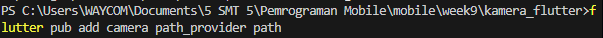
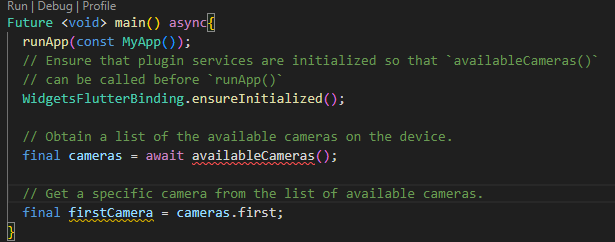

# kamera_flutter

## Langkah 2


## Langkah 3: Ambil sensor kamera dari device
Selanjutnya, kita perlu mengecek jumlah kamera yang tersedia pada perangkat menggunakan plugin camera seperti pada kode berikut ini. Kode ini letakkan dalam void main().


## Langkah 4: Buat dan inisialisasi CameraController

```
class TakepictureScreen extends StatefulWidget {
  const TakepictureScreen({
    super.key,
    required this.camera,
  });

  final CameraDescription camera;

  @override
  TakePictureScreenState createState() => TakePictureScreenState();
}

class TakePictureScreenState extends State<TakepictureScreen> {
  late CameraController _controller;
  late Future<void> _initializeControllerFuture;

  @override
  void initState() {
    super.initState();
    // To display the current output from the camera,
    // create a CameraController.
    _controller = CameraController(
      // Get a specific camera from the list of available cameras
      widget.camera,
      // Define the resolution to use
      ResolutionPreset.high,
    );

    // Next, initialize the controller. This returns a Future
    _initializeControllerFuture = _controller.initialize();
  }

  @override
  void dispose() {
    // Dispose of the controller when the widget is disposed
    _controller.dispose();
    super.dispose();
  }
```

## Langkah 5: Gunakan CameraPreview untuk menampilkan preview foto

Gunakan widget CameraPreview dari package camera untuk menampilkan preview foto. Anda perlu tipe objek void berupa FutureBuilder untuk menangani proses async.

```
@override
  Widget build(BuildContext context) {
    return Scaffold(
      appBar: AppBar(title: const Text('Take a picture - NIM Anda')),
      // You must wait until the controller is initialized before displaying the
      // camera preview. Use a FutureBuilder to display a loading spinner until the
      // controller has finished initializing.
      body: FutureBuilder<void>(
        future: _initializeControllerFuture,
        builder: (context, snapshot) {
          if (snapshot.connectionState == ConnectionState.done) {
            // If the Future is complete, display the preview.
            return CameraPreview(_controller);
          } else {
            // Otherwise, display a loading indicator.
            return const Center(child: CircularProgressIndicator());
          }
        },
      ),
    );
  }
```
## Langkah 6: Ambil foto dengan CameraController

Anda dapat menggunakan CameraController untuk mengambil gambar menggunakan metode takePicture(), yang mengembalikan objek XFile, merupakan sebuah objek abstraksi File lintas platform yang disederhanakan. Pada Android dan iOS, gambar baru disimpan dalam direktori cache masing-masing, dan path ke lokasi tersebut dikembalikan dalam XFile.

Pada codelab ini, buatlah sebuah FloatingActionButton yang digunakan untuk mengambil gambar menggunakan CameraController saat pengguna mengetuk tombol.

Pengambilan gambar memerlukan 2 langkah:

Pastikan kamera telah diinisialisasi.
Gunakan controller untuk mengambil gambar dan pastikan ia mengembalikan objek Future.
Praktik baik untuk membungkus operasi kode ini dalam blok try / catch guna menangani berbagai kesalahan yang mungkin terjadi.

Kode berikut letakkan dalam Widget build setelah field body.

```
floatingActionButton: FloatingActionButton(
        // Provide an onPressed callback.
        onPressed: () async {
        // Take the Picture in a try / catch block. If anything goes wrong,
        // catch the error.
        try {
          // Ensure that the camera is initialized.
          await _initializeControllerFuture;

          // Attempt to take a picture and then get the location
          // where the image file is saved.
          final image = await _controller.takePicture();
        } catch (e) {
          // If an error occurs, log the error to the console.
          print(e);
        }
      },
      child: const Icon(Icons.camera_alt),
    ),
```

## Langkah 7: Buat Widget baru DisplayPictureScreen

Buatlah file baru pada folder widget yang berisi kode berikut.
```
class DisplaypictureScreen extends StatelessWidget {
  final String imagePath;

  const DisplaypictureScreen({super.key, required this.imagePath});

  @override
  Widget build(BuildContext context) {
    return Scaffold(
      appBar: AppBar(title: const Text('Display the Picture - 2241720176')),
      //The image is stored as a file on the device. Use the `Image.file` constructor
      //constructor with the given path to display the image.
      body: Image.file(File(imagePath)),
    );
  }
}

```
## Langkah 8: Edit main.dart

Edit pada file ini bagian runApp seperti kode berikut.
```
  runApp(
    MaterialApp(
      theme: ThemeData.dark(),
      home: TakePictureScreen(
        // Pass the appropriate camera to the TakePictureScreen widget.
        camera: firstCamera,
      ),
      debugShowCheckedModeBanner: false,
    ),
  );
```
## Langkah 9: Menampilkan Hasil Foto
Tambahkan kode seperti berikut pada bagian try / catch agar dapat menampilkan hasil foto pada DisplayPictureScreen.

```

```